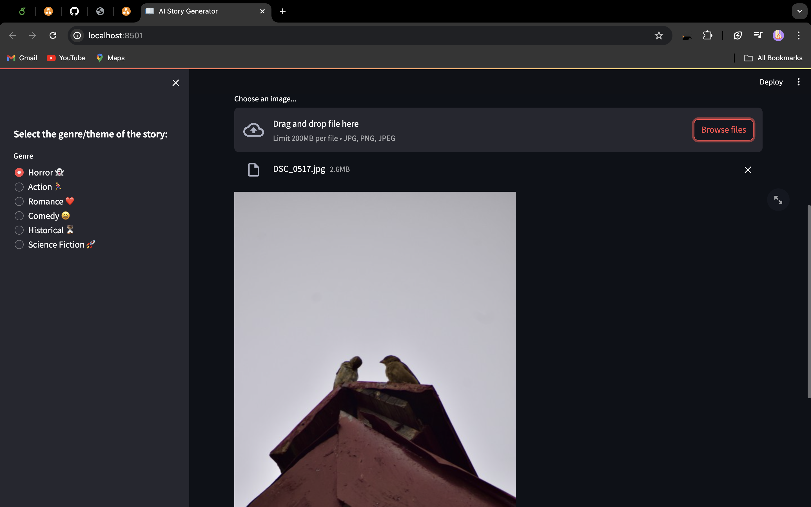

# KathaSangam: AI Story Generator

KathaSangam is an AI-powered story generator designed to create captivating stories based on text or image inputs provided by the user. Whether you have a specific theme in mind or want to explore various genres, KathaSangam generates unique and imaginative stories tailored to your preferences.

## Key Features

- **Text and Image Input**: Users can input text prompts or upload images to inspire story generation.

- **Theme Selection**: Choose from a variety of themes such as Horror, Action, Romance, Comedy, Historical, or Science Fiction to shape the narrative.

- **Audio Output**: KathaSangam generates audio files of the stories, allowing users to listen to the narrated version of their creations.

- **Download Options**: Stories can be downloaded as text files or audio files for offline access and sharing.

## Architecture

## Getting Started

To use KathaSangam, follow these steps:

1. **Launch the Application**: Open the KathaSangam web application.

2. **Choose Input Type**: Select whether you want to input text or upload an image.

3. **Select Theme**: Choose a theme or genre for the story from the sidebar.

4. **Input Text or Image**: Enter text prompts or upload an image based on which you want the story to be generated.

5. **Generate Story**: Click the "Generate Story" button to let KathaSangam create your personalized story.

6. **Explore and Download**: Read the generated story on the app interface, listen to the audio version, and download the story as a text file or audio file for later enjoyment.

## Technologies Used

- **Streamlit**: Frontend development and web application deployment.
- **gTTS (Google Text-to-Speech)**: Converts text input into audio files.
- **Clarifai AI Engine**: Powers image-to-text conversion for story generation.
- **TensorFlow/Keras**: Utilized for deep learning models and text-to-text generation.
- **Pandas/Numpy**: Data manipulation and preprocessing.

## Screenshots Of the UI

## Contributors
- Subhangi Sati (subhangi.sati270@gmail.com)
- Purvika Joshi (purvikajoshi2002@gmail.com)

## Acknowledgments

Special thanks to the developers, researchers, and organizations whose work contributed to the development of KathaSangam.

## Feedback and Support

For feedback, suggestions, or support inquiries, please contact [subhangi.sati270@gmail.com](mailto:subhangi.sati270@gmail.com).

